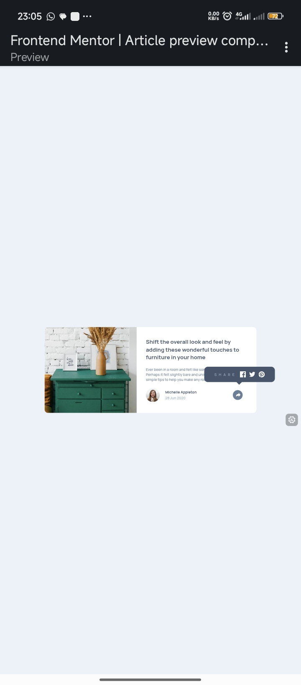

# Frontend Mentor - Article preview component solution

This is a solution to the [Article preview component challenge on Frontend Mentor](https://www.frontendmentor.io/challenges/article-preview-component-dYBN_pYFT). Frontend Mentor challenges help you improve your coding skills by building realistic projects. 

## Table of contents

- [Overview](#overview)
  - [Screenshot](#screenshot)
  - [Links](#links)
- [My process](#my-process)
  - [Built with](#built-with)
  - [What I learned](#what-i-learned)
  - [Continued development](#continued-development)
- [Author](#author)

## Overview
  A practice frontend mentor project of a Article_preview_component_practice design
  Testing CSS and JS
  
### Screenshot

### Links

- Solution URL: [Solution](https://github.com/triplekdev/Article_preview_component_practice)
- Live Site URL: [Site](https://article-preview-component-practice-3k.netlify.app/)

## My process

### Built with

- Semantic HTML5 markup
- CSS custom properties
- Flexbox
- Mobile-first workflow

### What I learned

I learnt better use of css variables, and use of comments, use of layers and understanding the css cascade. I also increased my understanding of JS

### Continued development

I'm going to continue developing my JS understanding and usage

## Author

- Github - [Triple K](https://github.com/triplekdev)
- Frontend Mentor - [@triplekdev](https://www.frontendmentor.io/profile/triplekdev)
- Twitter - [@3plkk](https://x.com/3plkk)